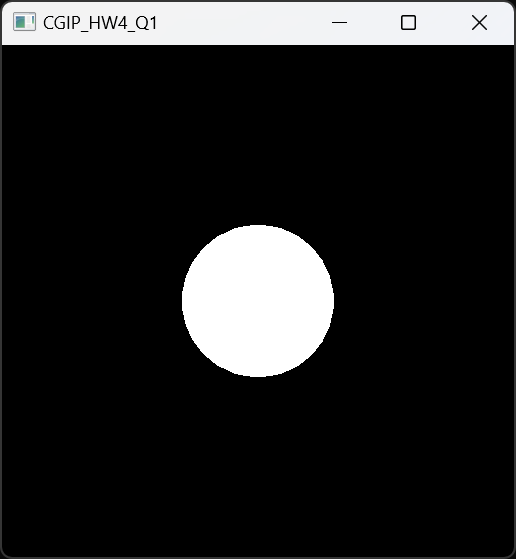

# 컴퓨터그래픽스및영상처리 과제 1

- 본 과제의 개발 환경으로는 vscode와 cmake를 사용하였습니다.
- 초기 환경 설정 및 openGL을 다루는 데에 필요한 스킬은 링크를 따라가면 확인하실 수 있는 [유튜브 영상 재생목록](https://www.youtube.com/playlist?list=PLvNHCGtd4kh_cYLKMP_E-jwF3YKpDP4hf)을 참고하여 공부하였습니다.
- OpenGL과 glm을 활용하여 transformation을 진행하는 방법은 [link](https://blog.naver.com/junsueg5737/220511107783)를 참고하였습니다.

---

### 문서 목차
- [환경 설정](#환경-설정)

- [실행 방법](#실행-방법)

- [결과 화면](#결과-화면)

- [Code 설명](#code-설명)

---

### 환경 설정

- vscode version 1.87을 사용하였습니다.
- cmake는 최소한 version 3.23을 사용해야 합니다.
- 본 repository에 있는 CMakeLists.txt와 Dependency.cmake 파일을 통해 필요한 library를 초기 빌드 시 한 번에 다운로드 받을 수 있습니다.

---

### 실행 방법

1. vscode를 실행 후, 해당 project가 있는 directory를 열어 project folder를 load해줍니다.
2. CMake를 위한 vscode extension이 필요하므로, extension이 존재하지 않는다면 vscode 좌측의 Extensions 탭에서 cmake를 검색하여 CMake와 CMake Tools를 install 해줍니다.
3. Windows 환경에서는 ctrl + shift + p, Mac 환경에서는 cmd + p 키를 입력하여 command를 입력할 수 있는 창에서 cmake를 검색 후 CMake:Configure를 선택하고, 운영체제에 맞게 컴파일러 키트를 선택합니다.

    (혹은 해당 프로젝트가 있는 폴더에서 cmd 창을 열고 code .를 입력하면 자동으로 CMake project임을 인식하고 configure를 위한 팝업이 뜹니다.)

    Configure를 수행하면 vscode 하단의 OUTPUT 탭에 "Configuring project: CGIP_hw1"이라고 출력되는 것을 확인하실 수 있습니다.

4. CMake 프로젝트로 인식이 되었으면, 다시 command를 입력할 수 있는 창을 열고 CMake를 검색하여 CMake:Build를 선택합니다 (혹은 단축키인 F7을 입력합니다).

    초기 build라면, 이때 필요한 library가 전부 build 폴더에 다운로드 됩니다.

5. 초기 build를 마친 후, ctrl + F5를 입력하면 Debug 모드로 project가 실행됩니다.
Debug 모드이므로 하단의 DEBUG CONSOLE에서 출력 및 동작을 확인할 수 있습니다.

---

### 결과 화면

- Q1에 대한 결과 화면은 다음과 같습니다.
    - triangle mesh로 구성된 sphere에 대하여 색 표현 없이 unshaded에 대한 결과만 흰색으로 나타낸 화면입니다.
<p align="center">
    
</p>

---

### Code 설명

- 모든 소스코드 파일은 src 폴더에 있습니다.
    - sphere_scene.cpp 파일은 기본으로 제공된 파일을 수정한 파일입니다.
    
        아래는 sphere_scene.cpp 파일에서 수정된 내용에 대한 설명입니다.

- glm::vec3* vertices 변수

    이 변수는 여러 vertex들의 값을 저장하기 위한 vec3 array입니다.

    해당 변수는 이후 create_scene() 함수 내에서 다음과 같이 초기화됩니다.
    ```
    vertices = new vec3[gNumVertices];
    ```
    for loop 내에서, vertices 변수에는 다음과 같은 값을 가지게 됩니다.
    ```
    vertices[t] = vec3(x, y, z);
    ```
    이후 t 값을 하나씩 증가시켜 for loop을 돌면서 매번 새로운 vertex 값을 array에 저장하도록 합니다.

    마지막으로 for loop을 빠져나와 구의 고점과 저점을 설정합니다.
    ```
    vertices[t++] = vec3(0, 1, 0);

    vertices[t++] = vec3(0, -1, 0);
    ```
    기존에 t++;로 작성되어 있던 부분을 위와 같이 대체하였습니다.
    
    이 외에 수정된 부분은 없습니다.

    - main.cpp 파일이 동작의 핵심이 되는 파일입니다.

        아래는 main.cpp 파일의 각 함수에 대하여 설명하기 위한 내용입니다.

- mat4 multipl_mtx_mtx (mat4 mtx_a, mat4 mtx_b) 함수

    이 함수는 4차원 행렬 간의 곱을 위하여 생성한 함수입니다.

    행렬 a와 b의 각 원소간의 곱 및 합을 통하여 새로운 4차원 행렬인 result를 생성하고 이를 반환합니다.

    transformation pipeline을 구성하기 위하여 필요한 함수입니다.

    ```
    mat4 multipl_mtx_mtx(mat4 mtx_a, mat4 mtx_b) {
        vec4 a_row1(mtx_a[0][0], mtx_a[0][1], mtx_a[0][2], mtx_a[0][3]);
        vec4 a_row2(mtx_a[1][0], mtx_a[1][1], mtx_a[1][2], mtx_a[1][3]);
        vec4 a_row3(mtx_a[2][0], mtx_a[2][1], mtx_a[2][2], mtx_a[2][3]);
        vec4 a_row4(mtx_a[3][0], mtx_a[3][1], mtx_a[3][2], mtx_a[3][3]);

        vec4 b_row1(mtx_b[0][0], mtx_b[0][1], mtx_b[0][2], mtx_b[0][3]);
        vec4 b_row2(mtx_b[1][0], mtx_b[1][1], mtx_b[1][2], mtx_b[1][3]);
        vec4 b_row3(mtx_b[2][0], mtx_b[2][1], mtx_b[2][2], mtx_b[2][3]);
        vec4 b_row4(mtx_b[3][0], mtx_b[3][1], mtx_b[3][2], mtx_b[3][3]);

        float x11 = a_row1.x * b_row1.x + a_row1.y * b_row2.x + a_row1.z * b_row3.x + a_row1.w * b_row4.x;  //a11*b11 + a12*b21 + a13*b31 + a14*b41
        float x12 = a_row1.x * b_row1.y + a_row1.y * b_row2.y + a_row1.z * b_row3.y + a_row1.w * b_row4.y;  //a11*b12 + a12*b22 + a13*b32 + a14*b42
        float x13 = a_row1.x * b_row1.z + a_row1.y * b_row2.z + a_row1.z * b_row3.z + a_row1.w * b_row4.z;  //a11*b13 + a12*b23 + a13*b33 + a14*b43
        float x14 = a_row1.x * b_row1.w + a_row1.y * b_row2.w + a_row1.z * b_row3.w + a_row1.w * b_row4.w;  //a11*b14 + a12*b24 + a13*b34 + a14*b44

        float x21 = a_row2.x * b_row1.x + a_row2.y * b_row2.x + a_row2.z * b_row3.x + a_row2.w * b_row4.x;  //a21*b11 + a22*b21 + a23*b31 + a24*b41
        float x22 = a_row2.x * b_row1.y + a_row2.y * b_row2.y + a_row2.z * b_row3.y + a_row2.w * b_row4.y;  //a21*b12 + a22*b22 + a23*b32 + a24*b42
        float x23 = a_row2.x * b_row1.z + a_row2.y * b_row2.z + a_row2.z * b_row3.z + a_row2.w * b_row4.z;  //a21*b13 + a22*b23 + a23*b33 + a24*b43
        float x24 = a_row2.x * b_row1.w + a_row2.y * b_row2.w + a_row2.z * b_row3.w + a_row2.w * b_row4.w;  //a21*b14 + a22*b24 + a23*b34 + a24*b44

        float x31 = a_row3.x * b_row1.x + a_row3.y * b_row2.x + a_row3.z * b_row3.x + a_row3.w * b_row4.x;  //a31*b11 + a32*b21 + a33*b31 + a34*b41
        float x32 = a_row3.x * b_row1.y + a_row3.y * b_row2.y + a_row3.z * b_row3.y + a_row3.w * b_row4.y;  //a31*b12 + a32*b22 + a33*b32 + a34*b42
        float x33 = a_row3.x * b_row1.z + a_row3.y * b_row2.z + a_row3.z * b_row3.z + a_row3.w * b_row4.z;  //a31*b13 + a32*b23 + a33*b33 + a34*b43
        float x34 = a_row3.x * b_row1.w + a_row3.y * b_row2.w + a_row3.z * b_row3.w + a_row3.w * b_row4.w;  //a31*b14 + a32*b24 + a33*b34 + a34*b44

        float x41 = a_row4.x * b_row1.x + a_row4.y * b_row2.x + a_row4.z * b_row3.x + a_row4.w * b_row4.x;  //a41*b11 + a42*b21 + a43*b31 + a44*b41
        float x42 = a_row4.x * b_row1.y + a_row4.y * b_row2.y + a_row4.z * b_row3.y + a_row4.w * b_row4.y;  //a41*b12 + a42*b22 + a43*b32 + a44*b42
        float x43 = a_row4.x * b_row1.z + a_row4.y * b_row2.z + a_row4.z * b_row3.z + a_row4.w * b_row4.z;  //a41*b13 + a42*b23 + a43*b33 + a44*b43
        float x44 = a_row4.x * b_row1.w + a_row4.y * b_row2.w + a_row4.z * b_row3.w + a_row4.w * b_row4.w;  //a41*b14 + a42*b24 + a43*b34 + a44*b44

        mat4 result(vec4(x11, x12, x13, x14),
                    vec4(x21, x22, x23, x24),
                    vec4(x31, x32, x33, x34),
                    vec4(x41, x42, x43, x44));

        return result;
    }
    ```

- vec4 multipl_mtx_vec(mat4 mtx, vec4 vec) 함수

    이 함수는 4차원 행렬과 4차원 벡터 사이의 곱을 위한 함수입니다.

    행렬과 벡터의 원소 간의 곱 및 합을 통하여 새로운 4차원 벡터인 result를 생성하고 이를 반환합니다.

    transformation pipeline을 거쳐 도출되는 결과값을 계산하기 위한 함수입니다.
    ```
    vec4 multipl_mtx_vec(mat4 mtx, vec4 vec) {
        vec4 row1(mtx[0][0], mtx[0][1], mtx[0][2], mtx[0][3]);
        vec4 row2(mtx[1][0], mtx[1][1], mtx[1][2], mtx[1][3]);
        vec4 row3(mtx[2][0], mtx[2][1], mtx[2][2], mtx[2][3]);
        vec4 row4(mtx[3][0], mtx[3][1], mtx[3][2], mtx[3][3]);

        float x = row1.x * vec.x + row1.y * vec.y + row1.z * vec.z + row1.w * vec.w;    //a11*x + a12*y + a13*z + a14*w
        float y = row2.x * vec.x + row2.y * vec.y + row2.z * vec.z + row2.w * vec.w;    //a21*x + a22*y + a23*z + a24*w
        float z = row3.x * vec.x + row3.y * vec.y + row3.z * vec.z + row3.w * vec.w;    //a31*x + a32*y + a33*z + a34*w
        float w = row4.x * vec.x + row4.y * vec.y + row4.z * vec.z + row4.w * vec.w;    //a41*x + a42*y + a43*z + a44*w

        vec4 result = vec4(x, y, z, w);

        return result;
    }
    ```

- mat4 transformation_pipeline(Camera camera) 함수

    이 함수는 transformation pipeline을 설정하기 위한 함수입니다.

    인자 값으로 받아오는 Camera 변수는 struct에 해당하며, struct Camera는 다음과 같습니다.

    eye_point는 카메라의 위치이며, u, v, w 벡터는 좌표 벡터입니다.

    현재 값으로 camera에 대한 행렬을 구성하면 identity matrix가 되므로, inverse camera matrix 또한 identity matrix가 됩니다.

    ```
    struct Camera {
        vec3 eye_point = vec3(0.0f, 0.0f, 0.0f);

        vec3 u = vec3(1, 0, 0);
        vec3 v = vec3(0, 1, 0);
        vec3 w = vec3(0, 0, 1);
    };
    ```

    tx, ty, tz 값과 sx, sy, sz, 그리고 l, r, b, t, n, f 값은 전부 과제 안내 pdf에 적혀있는 값들이므로 고정된 값으로 넣어 두었습니다.
    
    초기 값으로 identity matrix인 mtx를 두고 이 matrix에 순서대로 scaling matrix, translation matrix, camera transformation matrix, perspective projection matrix, viewport transformation matrix를 곱합니다.

    그리고 최종적으로 mtx를 반환하면, transformation pipeline을 거친 최종 matrix가 도출됩니다.
    ```
    mat4 transformation_pipeline(Camera camera) {
        float tx = 0.0f;
        float ty = 0.0f;
        float tz = -7.0f;

        float sx = 2.0f;
        float sy = 2.0f;
        float sz = 2.0f;
        
        float l = -0.1f;
        float r = 0.1f;
        float b = -0.1f;
        float t = 0.1f;
        float n = -0.1f;
        float f = -1000.0f;

        mat4 mtx(vec4(1, 0, 0, 0),
                vec4(0, 1, 0, 0),
                vec4(0, 0, 1, 0),
                vec4(0, 0, 0, 1));

        // translation mtx
        mat4 trans_mtx = mat4(vec4(1, 0, 0, tx),
                            vec4(0, 1, 0, ty),
                            vec4(0, 0, 1, tz),
                            vec4(0, 0, 0, 1));

        // scaling mtx
        mat4 scale_mtx(vec4(sx, 0, 0, 0),
                    vec4(0, sy, 0, 0),
                    vec4(0, 0, sz, 0),
                    vec4(0, 0, 0, 1));

        // camera transformation mtx
        mat4 camera_mtx(vec4(camera.u.x, camera.v.x, camera.w.x, camera.eye_point.x),
                        vec4(camera.u.y, camera.v.y, camera.w.y, camera.eye_point.y),
                        vec4(camera.u.z, camera.v.z, camera.w.z, camera.eye_point.z),
                        vec4(0, 0, 0, 1));

        mat4 inverse_camera_mtx = inverse(camera_mtx);
        //since camera_mtx is identity matrix, inverse_camera_mtx is also identity matrix

        // perspective projection mtx
        mat4 perspective_projection_mtx(vec4(2 * n / (r - l), 0, (l + r) / (l - r), 0),
                                        vec4(0, 2 * n / (t - b), (b + t) / (b - t), 0),
                                        vec4(0, 0, (n + f) / (n - f), 2 * f * n/ (f - n)),
                                        vec4(0, 0, 1, 0));

        // viewport transformation mtx
        mat4 viewport_trans_mtx(vec4(Nx / 2, 0, 0, (float)(Nx - 1) / 2),
                                vec4(0, Ny / 2, 0, (float)(Ny - 1) / 2),
                                vec4(0, 0, 1, 0),
                                vec4(0, 0, 0, 1));

        // transformation pipeline
        // scale -> translate -> camera -> perspective projection -> viewport transformation
        mtx = multipl_mtx_mtx(scale_mtx, mtx);

        mtx = multipl_mtx_mtx(trans_mtx, mtx);

        mtx = multipl_mtx_mtx(inverse_camera_mtx, mtx);

        mtx = multipl_mtx_mtx(perspective_projection_mtx, mtx);

        mtx = multipl_mtx_mtx(viewport_trans_mtx, mtx);

        return mtx;
    }
    ```

- main 함수
    
    main 함수에서는 우선 sphere_scene.cpp 파일의 create_scene() 함수를 호출합니다.
    그리고 struct Camera 또한 호출합니다.

    먼저, 전체 이미지를 검은색으로 덮습니다.
    이미지는 전역변수로 unsigned char image[Nx * Ny * 3]; 와 같이 선언해두었습니다.
    ```
    // first set image to black
    for (int i = 0; i < Nx; i++) {
        for (int j = 0; j < Ny; j++) {
            image[(j * Nx + i) * 3] = 0;
            image[(j * Nx + i) * 3 + 1] = 0;
            image[(j * Nx + i) * 3 + 2] = 0;
        }
    }
    ```

    다음으로, 전체 vertex 개수에 대하여 vertex의 값을 loop를 돌며 구합니다.
    
    vertex 값은 vertices를 불러옴으로써 초기값을 설정하며, transformation pipeline을 통과한 후 vertex 값을 다시 계산해서 vertices에 저장합니다.
    ```
    for (int i = 0; i < gNumVertices; i++) {
        // get vertices from vertices array
        vec4 vertex(vertices[i].x, vertices[i].y, vertices[i].z, 1);
        
        // transformation pipeline
        mat4 mtx = transformation_pipeline(camera);

        // multiply the transformation matrix with the vertex
        vertex = multipl_mtx_vec(mtx, vertex);

        // normalize vertex values
        vertex.x = vertex.x / vertex.w;
        vertex.y = vertex.y / vertex.w;
        vertex.z = vertex.z / vertex.w;
        vertex.w = vertex.w / vertex.w;

        // put normalized values back to the vertices array
        vertices[i].x = vertex.x;
        vertices[i].y = vertex.y;
        vertices[i].z = vertex.z;
    }
    ```

    이후 for loop을 돌며 각각의 삼각형에 대하여 3 개의 꼭지점에 대한 좌표를 찾습니다.
    각 꼭지점은 point_a, point_b, point_c로 이름을 붙였습니다.

    xmin, xmax, ymin, ymax 값을 구하여 삼각형에 대한 bounding box를 설정하고, 이 값에 대하여 beta와 gamma 값을 구합니다.

    beta_x는 x축 방향으로의 beta의 기울기, beta_y는 y축 방향으로의 beta의 기울기를 의미하므로 각 방향에 대한 기울기를 구합니다.
    gamma_x와 gamma_y에 대해서도 마찬가지로 구합니다.

    이후 int n 값을 설정하고, for loop을 돌며 beta와 gamma 값을 살펴보고 삼각형 mesh 내에 들어가는 픽셀을 전부 흰색으로 칠합니다.

    beta 값과 gamma 값은 for loop을 돌며 더해갑니다.
    
    이를 구 전체를 구성하는 삼각형 mesh에 대하여 전부 반복해주면 구를 그릴 수 있습니다.
    ```
    for (int i = 0; i < gNumTriangles; i++) {
        // index of the vertices of the triangle
        int k0 = gIndexBuffer[3 * i];
        int k1 = gIndexBuffer[3 * i + 1];
        int k2 = gIndexBuffer[3 * i + 2];

        // get the vertices of the triangle
        vec3 point_a = vec3(vertices[k0]);
        vec3 point_b = vec3(vertices[k1]);
        vec3 point_c = vec3(vertices[k2]);

        // get bounding box of the triangle
        int xmin = std::min(std::min(point_a.x, point_b.x), point_c.x);
        int xmax = std::max(std::max(point_a.x, point_b.x), point_c.x);
        int ymin = std::min(std::min(point_a.y, point_b.y), point_c.y);
        int ymax = std::max(std::max(point_a.y, point_b.y), point_c.y);

        // starting point of each beta and gamma
        float beta = ((point_a.y - point_c.y) * xmin + (point_c.x - point_a.x) * ymin + point_a.x * point_c.y - point_c.x * point_a.y) / ((point_a.y - point_c.y) * point_b.x + (point_c.x - point_a.x) * point_b.y + point_a.x * point_c.y - point_c.x * point_a.y);
        float gamma = ((point_a.y - point_b.y) * xmin + (point_b.x - point_a.x) * ymin + point_a.x * point_b.y - point_b.x * point_a.y) / ((point_a.y - point_b.y) * point_c.x + (point_b.x - point_a.x) * point_c.y + point_a.x * point_b.y - point_b.x * point_a.y);

        // increasing value of beta and gamma in each axis
        float beta_x = (point_a.y - point_c.y) / ((point_a.y - point_c.y) * point_b.x + (point_c.x - point_a.x) * point_b.y + point_a.x * point_c.y - point_c.x * point_a.y);
        float beta_y = (point_c.x - point_a.x) / ((point_a.y - point_c.y) * point_b.x + (point_c.x - point_a.x) * point_b.y + point_a.x * point_c.y - point_c.x * point_a.y);

        float gamma_x = (point_a.y - point_b.y) / ((point_a.y - point_b.y) * point_c.x + (point_b.x - point_a.x) * point_c.y + point_a.x * point_b.y - point_b.x * point_a.y);
        float gamma_y = (point_b.x - point_a.x) / ((point_a.y - point_b.y) * point_c.x + (point_b.x - point_a.x) * point_c.y + point_a.x * point_b.y - point_b.x * point_a.y);

        int n = (xmax - xmin) + 1;

        for (int y = ymin; y <= ymax; y++) {
            for (int x = xmin; x <= xmax; x++) {
                if(beta > 0 && gamma > 0 && beta + gamma < 1) {
                    int idx = (y * Ny + x) * 3;
                    image[idx] = 255;
                    image[idx + 1] = 255;
                    image[idx + 2] = 255;
                }
                beta += beta_x;
                gamma += gamma_x;
            }
            beta += beta_y - n * beta_x;
            gamma += gamma_y - n * gamma_x;
        }   
    }
    ```

    이후 glDrawPixels(Nx, Ny, GL_RGB, GL_UNSIGNED_BYTE, image); 를 통해 이미지를 출력합니다.
---

## 감사합니다.

##### 제출자: 건국대학교 대학원 컴퓨터공학과 202371451 허윤아